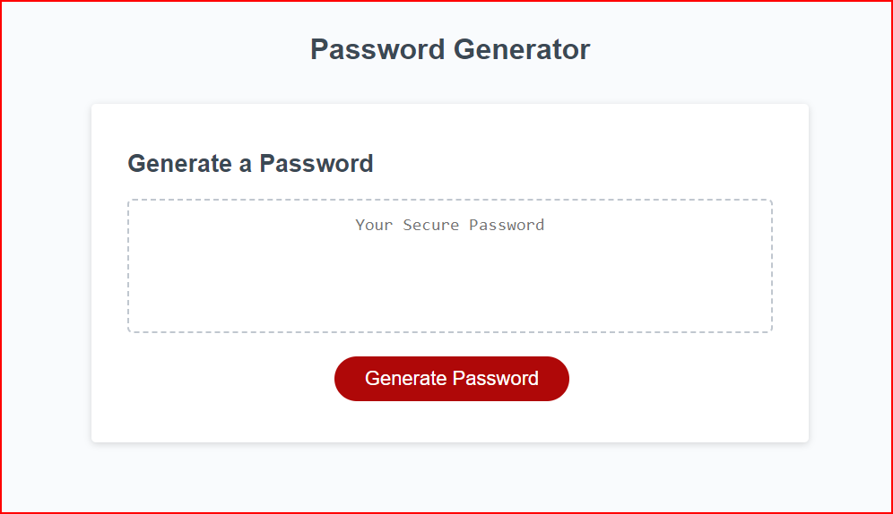

# Password-Generation
## Table of Contents

- [Description](#Description)
- [Project URL](#Project-URL)
- [Deployment](#Deployment)
- [Demo/Screenshots](#Demo/Screenshots)
- [Technologies](#Technologies)
- [License](#License)
- [Resources](#Resources)
- [Contact](#Contact)
- [Author](#Author)

## Project URL

<https://kaleikautakaoka.github.io/Password-Generation/>

## Delpoyment

- [https://kaleikautakaoka.github.io/Password-Generation/](https://kaleikautakaoka.github.io/Password-Generation/)

## Demo/Screenshots

  <table>
    <tr>
      <td>Password Generator Page Example</td>
    </tr>
    <tr>
      <td></td>
    </tr>
  </table>

## Technologies

```
HTML, CSS, Javascript
```

## License

This project is [mit](https://choosealicense.com/licenses/mit/) licensed.

## Resources

- [pixabay](https://pixabay.com/)
- [w3schools](https://www.w3schools.com/)

## Contact

Email: stakaoka@iml.org

## Author

Author(s): Sachi Kaleikau-Takaoka
GitHub: <https://github.com/kaleikautakaoka>
